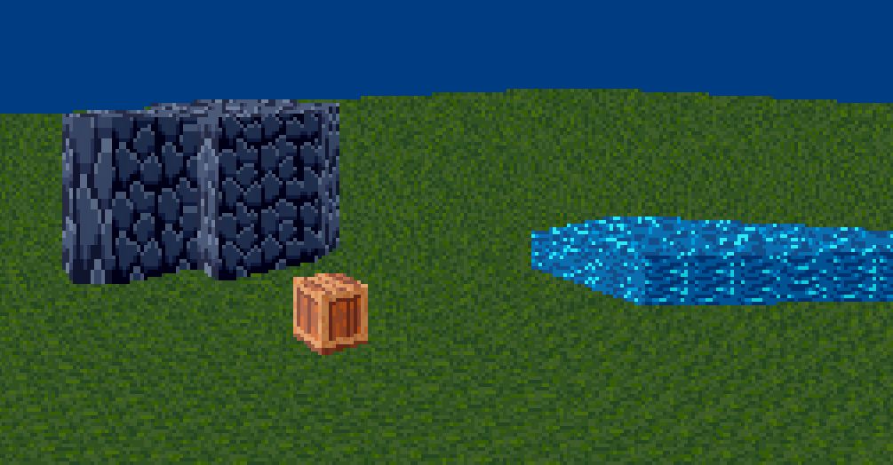

# 3D Viewer

This viewer generates 3d planes of sectors which are composed of walls, by having closer points being drawn closer to the center, with the drawing of textures being done by drawing vertical lines from the left most line of a wall, to the right. Textures are converted from bitmaps to header files that can be read by the C code in drawing the walls.

To move the camera, WASD is used to move forward, left, backward, and right respectively. The keys '<' and '>' spin the camera around, and when pressing the 'm' key, WASD turn into new directions for the camera to move in.

This viewer can be compiled with CMake.

